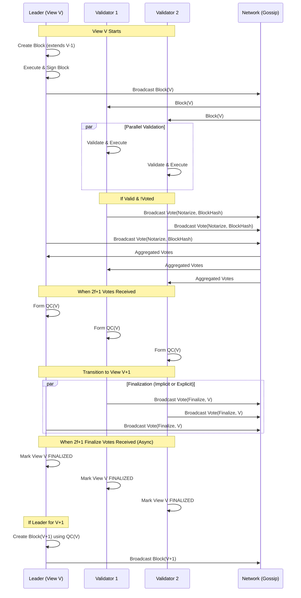

# Simplex Consensus Flow

This document details the consensus mechanism used in the Ockham network, known as **Simplex**. It is a leader-based, vote-driven consensus protocol similar to HotStuff/PBFT, operating in **Views**.

## High-Level Overview

Simplex proceeds in **Views**. In each view, a deterministic **Leader** proposes a **Block**. **Validators** (the committee) receive the block, validate it, and **Vote** to notarize it. If a supermajority ($2f+1$) of votes is aggregated, a **Quorum Certificate (QC)** is formed. The formation of a QC for a view justifies the proposal of the *next* block and triggers **Finalization** of the view.

## Participants
*   **Leader:** Deterministically selected for each view ($ViewNumber \pmod {CommitteeSize}$).
*   **Validators (Committee):** A fixed set of nodes that sign votes.
*   **Learners:** Non-validating nodes that synchronize the chain.

## Detailed Flow

### 1. Proposal Phase
The **Leader** for the current View $V$:
1.  Constructs a **Block** containing:
    *   **Parent Hash:** Hash of the preferred block (highest QC known).
    *   **Justify:** The QC for the parent block.
    *   **Payload:** Transactions from the memory pool.
    *   **State Root:** Result of executing the transactions.
2.  Executes the block locally to ensure validity.
3.  **Broadcasts** the `Block` to the network via Gossipsub.
4.  **Votes** for its own block immediately.

### 2. Validation Phase
Upon receiving a `Block` for View $V$, a **Validator**:
1.  **Checks View:** ensures $Block.View \ge Local.View$.
2.  **Verifies Parent:** Checks if `ParentHash` exists and is valid. If missing, requests sync.
3.  **Executes:** Re-executes the block's transactions to verify `StateRoot` and `ReceiptsRoot`.
4.  **Verifies QC:** Checks if the block's `Justify` QC is valid (correct aggregate signature).
5.  **Checks Equivocation:** Ensures it hasn't already voted for a different block in View $V$.

### 3. Voting Phase (Notarize)
If the block is valid:
1.  The Validator updates its state (`LastVotedView` = $V$).
2.  Constructs a **Vote** of type `Notarize`.
    *   Signs the `BlockHash`.
3.  **Broadcasts** the `Vote` to the network.

### 4. QC Formation (Consensus)
Nodes accumulate `Vote` messages. When a node gathers $2f+1$ votes for the same `BlockHash` in View $V$:
1.  A **Quorum Certificate (QC)** is formed.
2.  The node saves the QC.
3.  **View Advance:** The node advances to View $V+1$.
4.  **Finalization Vote:** The node broadcasts a `Finalize` vote for View $V$.

### 5. Finalization Phase
When a node gathers $2f+1$ `Finalize` votes for View $V$:
1.  The View $V$ is marked as **Finalized**.
2.  The block for View $V$ and its ancestors are considered immutable.
3.  State changes are officially committed to persistent storage.

### 6. Chaining (Pipelines)
*   The QC formed in View $V$ serves as the `Justify` proof for the Leader of View $V+1$.
*   This creates a chain of blocks, each justifying the previous one.

### 7. Timeout / Liveness
If a View takes too long (Leader offline or slow):
1.  Validators time out.
2.  They vote for a special **Dummy Block** (Hash Zero).
3.  If $2f+1$ vote for Dummy, a QC is formed for the Dummy block.
4.  Consensus moves to View $V+1$ building on top of the empty Dummy block (skipping the view effectively).

## Message Flow Diagram



## Data Structures

### Block
```rust
pub struct Block {
    pub author: PublicKey,
    pub view: View,
    pub parent_hash: Hash,
    pub justify: QuorumCertificate, // Proof of V-1
    pub state_root: Hash,
    pub payload: Vec<Transaction>,
    // ...
}
```

### Vote
```rust
pub struct Vote {
    pub view: View,
    pub block_hash: Hash,
    pub vote_type: VoteType, // Notarize or Finalize
    pub author: PublicKey,
    pub signature: Signature,
}
```

### QuorumCertificate (QC)
```rust
pub struct QuorumCertificate {
    pub view: View,
    pub block_hash: Hash,
    pub signature: Signature, // Aggregated Signature (BLS or similar)
    pub signers: Vec<PublicKey>,
}
```
